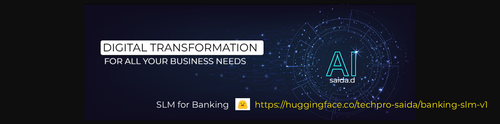

<h1 align="center">👋 Hi, I'm SAIDA.D </h1>

I'm **AI/ML Engineer | Data Scientist | GenAI, Agentic AI, AI Automation & Data Engineering Enthusiast** with 17+ years of experience in software development and 8 + years in AI/ML.

- 🔭 Currently working on: **AI/ML, Generative AI & MLOps, LLMOps, Azure AI Foundry, Azure AI Search, Copilot Studio,Azure AI Services, LangChain/LangGraph, Data Engineering**
- 💬 Ask me about: **ML, DL, NLP, RAG (advanced), Computer Vision, Agentic AI (with Multi agents), vLLM, KVCache, Celery/redis, AI Governance, AI Cost optimization, Loop engineering, FDE, Big Data, Azure Databricks, Python, Pyspark and Cloud**
- 🔭 Build Own LLM by Usecase?: **I have Full capable of building own LLM/(or finetune) which is usecase based**
- 📫 Reach me at: **programmer.sr@gmail.com**

## Certifications

| Microsoft Certified AI Engineer | Microsoft Certified Azure Data Scientist | Microsoft Certified Azure AI Fundamentals |
|:---:|:---:|:---:|
|  |  |  |
